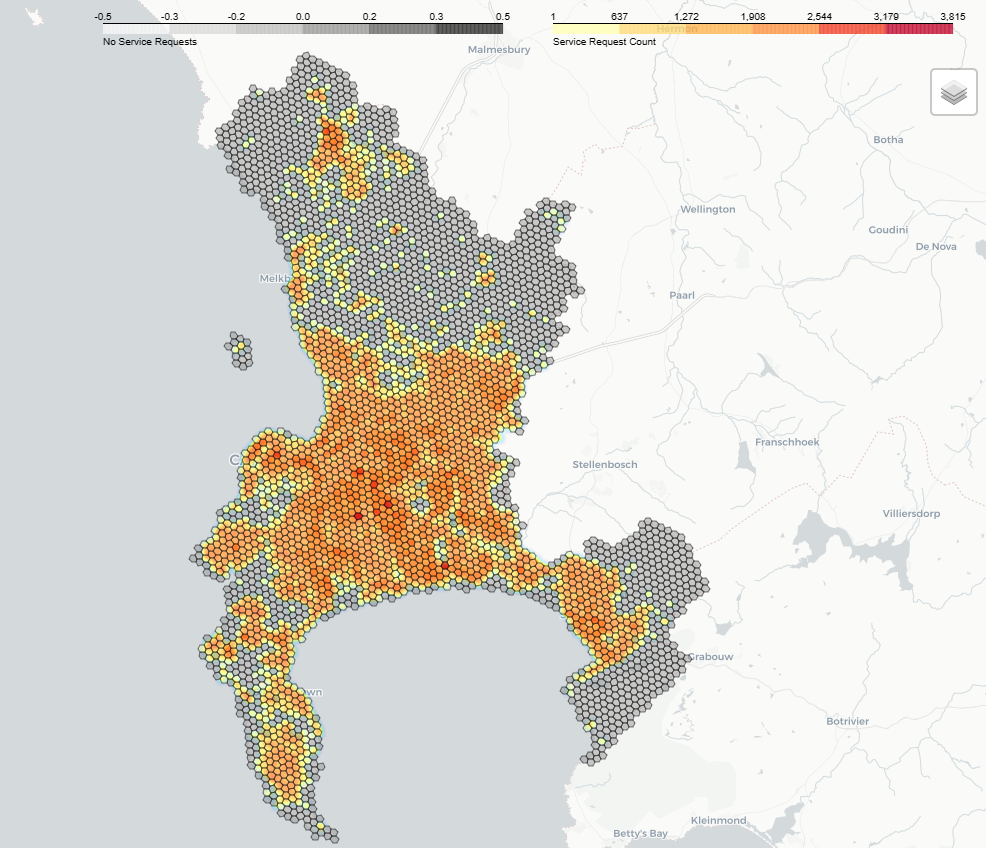

# Initial Data Transformation

## Library imports

Use **pip** or **conda** to install the required packages/libraries before running the notebook.


```python
#!pip install -r requirements.txt

import requests
from pathlib import Path
from datetime import datetime
from IPython.display import Markdown

import pandas as pd
import geopandas as gpd
from shapely.geometry import Point

import h3
import h3pandas  # More specialised H3 functions, specifically for use with Pandas

# Pandas alternatives (just for speed comparisons)
import vaex
import dask
#import polars
#import cudf

# Imports for interactive map visualisation.
# (Must mark this notebook as Trusted to see it.)
import folium
from folium.plugins import HeatMap, HeatMapWithTime
#import pydeck

```

## Display settings

Set the notebook display option to show all columns in full.


```python
pd.set_option('display.max_columns', None)
pd.set_option('display.max_colwidth', None)
```

## Data folders

This checks if the data files for the challenge are present, otherwise it downloads them from the S3 bucket.

Original files are stored in the **data** folder, while processed output will be written to the **output** folder.


```python
data_url = 'https://cct-ds-code-challenge-input-data.s3.af-south-1.amazonaws.com/'

data_folder = Path('./data/')
output_folder = Path('./output/')

data_files = [
    'sr.csv.gz',
    'sr_hex.csv.gz',
    #'sr_hex_truncated.csv',
    'city-hex-polygons-8.geojson',
    #'city-hex-polygons-8-10.geojson',
]

# Create `data` and `output` subfolders if they don't exist yet
data_folder.mkdir(parents=False, exist_ok=True)
output_folder.mkdir(parents=False, exist_ok=True)

for data_file in data_files:
    file_path = data_folder / data_file
    if not file_path.exists():
        display(Markdown(f'Downloading *{data_file}*...'))
        file_url = data_url + data_file
        response = requests.get(file_url)
        response.raise_for_status()
        with open(file_path, 'wb') as f:
            f.write(response.content)
    else:
        display(Markdown(f'*{data_file}* already exists.'))

display(Markdown('**Done.**'))
```


*sr.csv.gz* already exists.


*sr_hex.csv.gz* already exists.


*city-hex-polygons-8.geojson* already exists.


**Done.**


## Schema inspection

The first part of the task involves joining the features from `city-hex-polygons-8.geojson` to the service request entries in `sr_hex.csv.gz`.

Let's see what the schema looks like by just showing 1 item from each...


```python
pd.read_csv(data_folder / 'sr.csv.gz', nrows=1, index_col=0)
```


<div>
<style scoped>
    .dataframe tbody tr th:only-of-type {
        vertical-align: middle;
    }

    .dataframe tbody tr th {
        vertical-align: top;
    }

    .dataframe thead th {
        text-align: right;
    }
</style>
<table border="1" class="dataframe">
  <thead>
    <tr style="text-align: right;">
      <th></th>
      <th>notification_number</th>
      <th>reference_number</th>
      <th>creation_timestamp</th>
      <th>completion_timestamp</th>
      <th>directorate</th>
      <th>department</th>
      <th>branch</th>
      <th>section</th>
      <th>code_group</th>
      <th>code</th>
      <th>cause_code_group</th>
      <th>cause_code</th>
      <th>official_suburb</th>
      <th>latitude</th>
      <th>longitude</th>
    </tr>
  </thead>
  <tbody>
    <tr>
      <th>0</th>
      <td>400583534</td>
      <td>9109491785</td>
      <td>2020-10-07 06:55:18+02:00</td>
      <td>2020-10-08 15:36:35+02:00</td>
      <td>URBAN MOBILITY</td>
      <td>Roads Infrastructure Management</td>
      <td>RIM Area Central</td>
      <td>District: Blaauwberg</td>
      <td>TD Customer complaint groups</td>
      <td>Pothole&amp;Defect Road Foot Bic Way/Kerbs</td>
      <td>Road (RCL)</td>
      <td>Wear and tear</td>
      <td>MONTAGUE GARDENS</td>
      <td>-33.872839</td>
      <td>18.522488</td>
    </tr>
  </tbody>
</table>
</div>


```python
gpd.read_file(data_folder / 'city-hex-polygons-8.geojson', index_col='index').head(1)
```


<div>
<style scoped>
    .dataframe tbody tr th:only-of-type {
        vertical-align: middle;
    }

    .dataframe tbody tr th {
        vertical-align: top;
    }

    .dataframe thead th {
        text-align: right;
    }
</style>
<table border="1" class="dataframe">
  <thead>
    <tr style="text-align: right;">
      <th></th>
      <th>index</th>
      <th>centroid_lat</th>
      <th>centroid_lon</th>
      <th>geometry</th>
    </tr>
  </thead>
  <tbody>
    <tr>
      <th>0</th>
      <td>88ad361801fffff</td>
      <td>-33.859427</td>
      <td>18.677843</td>
      <td>POLYGON ((18.68119 -33.86330, 18.68357 -33.85928, 18.68023 -33.85541, 18.67450 -33.85555, 18.67211 -33.85957, 18.67546 -33.86345, 18.68119 -33.86330))</td>
    </tr>
  </tbody>
</table>
</div>


## Calculate the hexagon index

There appears to be no common key column that we can join on. We can calculate the H3 hexagon index from the `latitude` and `longitude` of each service request. That can then be matched up with the `index` of the geojson feature.

(We could also have done a point-in-polygon check on the polygon geometry, but that would have been much less efficient. Doing a search for the nearest centroid would be similarly inefficient, while also potentially inaccurate for points in the outer corners of the hexagon.)


```python
%%time

# Load the CSV file into a Pandas DataFrame
df = pd.read_csv(data_folder / 'sr.csv.gz', index_col=0)

# Replace NaN values in the latitude and longitude columns with 0
# NOTE: This is optional - h3pandas can work with NaNs.
#df[['latitude', 'longitude']] = df[['latitude', 'longitude']].fillna(value=0)

# Create a h3pandas DataFrame, calculating the h3 id from the latitude and longitude
h3df = df[['latitude', 'longitude']].h3.geo_to_h3(resolution=8, lat_col='latitude', lng_col='longitude')

# Append the h3 id column to the original DataFrame
df['h3_level8_index'] = h3df.index.to_frame(index=False)

# Set the h3 id to '0' if coordinates are missing
# NOTE: This is optional - h3pandas already does it internally.
#df.loc[df['latitude'].isnull() | df['longitude'].isnull(), 'h3_level8_index'] = 0

# Keep for later (validation)
df_pandas = df.copy()
```

    CPU times: total: 2.58 s
    Wall time: 2.58 s
    

## Validation

Check to make sure our results match the reference CSV file.


```python

# Check if the Pandas DataFrame contains the same values as the provided reference file
df_csv = pd.read_csv(data_folder / 'sr_hex.csv.gz', index_col=None)
matched = df_pandas.equals(df_csv)
display(Markdown(f'Pandas == sr_hex.csv: **{matched}**'))


```


Pandas == sr_hex.csv: **True**


## Join on hexagon index

Now that we have a common key, we can merge the two DataFrames together.


```python
%%time

# Read CSV file into Vaex dataframe
df_sr = vaex.from_csv(data_folder / 'sr_hex.csv.gz', index_col=None)
#print(len(df_sr))  # 941634

# Read GeoJSON file into GeoPandas dataframe
df_geo = gpd.read_file(data_folder / 'city-hex-polygons-8.geojson', index_col='index')
#print(len(df_geo))  # 3832

# Rename key column to match the other dataframe
df_sr.rename('h3_level8_index', 'index')

# Convert from GeoPandas to Vaex dataframe, depending on what kind of dataframe we want after merging
df_geo = vaex.from_pandas(df_geo)
#print(type(df_geo))  # <class 'vaex.dataframe.DataFrameLocal'>

# Merge the dataframes on the common index column
# NOTE: Vaex does not support outer join yet,
#       so we do a left join, which keeps all the service requests,
#       but discards any unmatched (empty) hexagon features.
merged = df_sr.join(df_geo, how='left', on='index', allow_duplication=False)
#print(len(merged))  # 941634 (same as service request count)

print(f'Column names after merge: { merged.column_names }\n')
#merged.head(5)
```

    Column names after merge: ['notification_number', 'reference_number', 'creation_timestamp', 'completion_timestamp', 'directorate', 'department', 'branch', 'section', 'code_group', 'code', 'cause_code_group', 'cause_code', 'official_suburb', 'latitude', 'longitude', 'index', 'centroid_lat', 'centroid_lon', 'geometry']
    
    CPU times: total: 2.73 s
    Wall time: 2.63 s
    

## Find unmatched entries

Even without merging, a comparison of the hex id's on both sides will indicate if there are any rows that won't match.

1. Check for service requests with hex id's that don't exist in the provided GeoJSON.

2. Check for hex id's in the GeoJSON that have no associated service requests.


```python

# Count number of service requests without coordinates
num_zero = len(df_sr[df_sr['index']=='0'])

# Get list of h3 index strings from both dataframes
sr_list = df_sr['index'].tolist()
geo_list = df_geo['index'].tolist()

# Convert to list to remove duplicates
sr_set = set(sr_list)
geo_set = set(geo_list)

# Only keep non-zero h3 id's
sr_set.discard('0')

# Get the difference between the sets
sr_unmatched = sr_set - geo_set
geo_unmatched = geo_set - sr_set

# Display some stats
display(Markdown(f'## Statistics'))
display(Markdown('&nbsp;'))
display(Markdown(f'Total service requests: **{ len(sr_list) }**'))
display(Markdown(f'- Without coordinates: **{ num_zero }**'))
display(Markdown(f'- Inside unlisted hexagons: **{ len(sr_unmatched) }**'))
display(Markdown(f'`{ list(sr_unmatched) }`'))
display(Markdown('&nbsp;'))
display(Markdown(f'Total listed hexagons: **{ len(geo_set) }**'))
display(Markdown(f'- With service requests: **{ len(sr_set) }**'))
display(Markdown(f'- Without service requests: **{ len(geo_unmatched) }**'))
display(Markdown('&nbsp;'))

```


## Statistics


&nbsp;


Total service requests: **941634**


- Without coordinates: **212364**


- Inside unlisted hexagons: **2**


`['88ad36c629fffff', '88ad361b51fffff']`


&nbsp;


Total listed hexagons: **3832**


- With service requests: **2082**


- Without service requests: **1752**


&nbsp;


## Error threshold

It is not entirely clear what the intent is with this part of the challenge instructions:

> Include logging that lets the executor know how many of the records failed to join, and include a join error threshold above which the script will error out. Please motivate why you have selected the error threshold that you have.

Maybe it's for SQL solutions?
Even a 100% failure rate doesn't necessarily mean there is a problem with the script. People might just be leaving out the coordinates when creating service requests, which would lead to an unjoined row that will not be shown on the map. Instead of triggering errors, these incomplete entries could instead be flagged for clean-up before even starting the merge.

## Distributed computing

Vaex already makes it possible to process the data in chunks, or across multiple processes on a single computer. But if the idea is to split the work across multiple machines on a network, we can use a Dask cluster. The syntax is similar to Pandas and Vaex. It can even utilise the GPU (with RAPIDS cuDF).

For now, we stick with just Vaex, though.


## Grouping / Aggregation

Show the total number of service requests per:
- Suburb (`official_suburb`)
- Directorate (`directorate`)
- Month (new column)
- hexagon (`index`)


```python
# Add calculated MMM YYYY column

# Define a function to extract month name and year from timestamp string
def get_month_name(timestamp_str):
    timestamp = datetime.strptime(timestamp_str, '%Y-%m-%d %H:%M:%S%z')
    return timestamp.strftime('%b %Y')

# Create a new column called 'month_name' containing the short month name and year format
merged['month_name'] = merged['creation_timestamp'].apply(get_month_name)

# List of months
print(set(merged['month_name'].tolist()))

# List of directorates
print(set(merged['directorate'].tolist()))

```

    {'Aug 2020', 'Jan 2020', 'Mar 2020', 'Nov 2020', 'May 2020', 'Oct 2020', 'Apr 2020', 'Sep 2020', 'Jul 2020', 'Jun 2020', 'Feb 2020', 'Dec 2020'}
    {'ENERGY', 'WATER AND SANITATION', 'COMMUNITY SERVICES AND HEALTH', 'ECONOMIC GROWTH', 'OFFICE OF THE CITY MANAGER', 'URBAN MOBILITY', 'FINANCE', 'SPATIAL PLANNING AND ENVIRONMENT', 'SAFETY AND SECURITY', 'CORPORATE SERVICES', 'URBAN WASTE MANAGEMENT', 'HUMAN SETTLEMENTS', None}
    


```python
%%time

# Service requests by suburb for specific directorate and month

df_only_water = merged[merged['directorate'] == 'WATER AND SANITATION']

df_only_recent = df_only_water[df_only_water['month_name'] == 'Dec 2020']

agg = df_only_recent.groupby(['official_suburb']).agg({'per_suburb': 'count'})

agg = agg.sort('per_suburb', ascending=False)

agg.head(10)
```

    CPU times: total: 672 ms
    Wall time: 2.01 s
    


<table>
<thead>
<tr><th>#                            </th><th>official_suburb  </th><th style="text-align: right;">  per_suburb</th></tr>
</thead>
<tbody>
<tr><td><i style='opacity: 0.6'>0</i></td><td>--               </td><td style="text-align: right;">        4140</td></tr>
<tr><td><i style='opacity: 0.6'>1</i></td><td>PHILIPPI         </td><td style="text-align: right;">        1131</td></tr>
<tr><td><i style='opacity: 0.6'>2</i></td><td>GUGULETU         </td><td style="text-align: right;">         602</td></tr>
<tr><td><i style='opacity: 0.6'>3</i></td><td>STRAND           </td><td style="text-align: right;">         492</td></tr>
<tr><td><i style='opacity: 0.6'>4</i></td><td>MANENBERG        </td><td style="text-align: right;">         487</td></tr>
<tr><td><i style='opacity: 0.6'>5</i></td><td>BONTEHEUWEL      </td><td style="text-align: right;">         483</td></tr>
<tr><td><i style='opacity: 0.6'>6</i></td><td>HOUT BAY         </td><td style="text-align: right;">         483</td></tr>
<tr><td><i style='opacity: 0.6'>7</i></td><td>LOTUS RIVER      </td><td style="text-align: right;">         433</td></tr>
<tr><td><i style='opacity: 0.6'>8</i></td><td>TAFELSIG         </td><td style="text-align: right;">         427</td></tr>
<tr><td><i style='opacity: 0.6'>9</i></td><td>EERSTERIVIER     </td><td style="text-align: right;">         388</td></tr>
</tbody>
</table>


## Preliminary visualisations

Some plots and charts to get a sense of the data before building a proper dashboard.

First prepare all the hexagon shapes, then all the individual points. Then plot it all on a Folium map.


```python
df = merged
#df = df_only_water

# Use only rows with valid hexagon id
df = df[df['index']!='0']

# Convert from Vaex to Pandas dataframe
df = df.to_pandas_df()

# Convert from Pandas to GeoPandas dataframe
gdf = gpd.GeoDataFrame(df, geometry='geometry')

# Group by h3 hexagon and add a column for number of entries per hexagon
grouped_gdf = gdf.groupby(['index']).size().reset_index(name='h3_sr_count')

# Merge columns we want to plot
gdf_with_count = gdf[['index', 'geometry']].drop_duplicates(subset=['index']).merge(grouped_gdf)

# Concatenate with unmatched 
gdf_unmatched = gpd.GeoDataFrame(df_geo[df_geo['index'].isin(geo_unmatched)][['index', 'geometry']].to_pandas_df(), geometry='geometry')
gdf_unmatched['h3_sr_count'] = 0  # Add a h3_sr_count column of 0 for all
gdf_final = pd.concat([gdf_with_count, gdf_unmatched], ignore_index=True)

gdf_final

```


<div>
<style scoped>
    .dataframe tbody tr th:only-of-type {
        vertical-align: middle;
    }

    .dataframe tbody tr th {
        vertical-align: top;
    }

    .dataframe thead th {
        text-align: right;
    }
</style>
<table border="1" class="dataframe">
  <thead>
    <tr style="text-align: right;">
      <th></th>
      <th>index</th>
      <th>geometry</th>
      <th>h3_sr_count</th>
    </tr>
  </thead>
  <tbody>
    <tr>
      <th>0</th>
      <td>88ad360225fffff</td>
      <td>POLYGON ((18.52747 -33.87500, 18.52985 -33.87098, 18.52651 -33.86711, 18.52078 -33.86724, 18.51840 -33.87126, 18.52174 -33.87514, 18.52747 -33.87500))</td>
      <td>118</td>
    </tr>
    <tr>
      <th>1</th>
      <td>88ad36d5e1fffff</td>
      <td>POLYGON ((18.85504 -34.08429, 18.85743 -34.08028, 18.85407 -34.07641, 18.84833 -34.07656, 18.84594 -34.08057, 18.84930 -34.08444, 18.85504 -34.08429))</td>
      <td>813</td>
    </tr>
    <tr>
      <th>2</th>
      <td>88ad36d437fffff</td>
      <td>POLYGON ((18.82350 -34.10880, 18.82589 -34.10479, 18.82253 -34.10092, 18.81679 -34.10107, 18.81440 -34.10508, 18.81776 -34.10894, 18.82350 -34.10880))</td>
      <td>712</td>
    </tr>
    <tr>
      <th>3</th>
      <td>88ad361133fffff</td>
      <td>POLYGON ((18.61103 -33.92441, 18.61341 -33.92040, 18.61007 -33.91652, 18.60434 -33.91666, 18.60195 -33.92068, 18.60530 -33.92455, 18.61103 -33.92441))</td>
      <td>1995</td>
    </tr>
    <tr>
      <th>4</th>
      <td>88ad361709fffff</td>
      <td>POLYGON ((18.45491 -33.98741, 18.45730 -33.98341, 18.45396 -33.97953, 18.44823 -33.97966, 18.44584 -33.98367, 18.44918 -33.98754, 18.45491 -33.98741))</td>
      <td>848</td>
    </tr>
    <tr>
      <th>...</th>
      <td>...</td>
      <td>...</td>
      <td>...</td>
    </tr>
    <tr>
      <th>3829</th>
      <td>88ad369711fffff</td>
      <td>POLYGON ((18.47441 -34.36137, 18.47681 -34.35739, 18.47346 -34.35353, 18.46772 -34.35366, 18.46533 -34.35764, 18.46867 -34.36150, 18.47441 -34.36137))</td>
      <td>0</td>
    </tr>
    <tr>
      <th>3830</th>
      <td>88ad369715fffff</td>
      <td>POLYGON ((18.48255 -34.35726, 18.48494 -34.35328, 18.48159 -34.34942, 18.47585 -34.34955, 18.47346 -34.35353, 18.47681 -34.35739, 18.48255 -34.35726))</td>
      <td>0</td>
    </tr>
    <tr>
      <th>3831</th>
      <td>88ad369717fffff</td>
      <td>POLYGON ((18.47346 -34.35353, 18.47585 -34.34955, 18.47250 -34.34569, 18.46676 -34.34581, 18.46437 -34.34980, 18.46772 -34.35366, 18.47346 -34.35353))</td>
      <td>0</td>
    </tr>
    <tr>
      <th>3832</th>
      <td>88ad369733fffff</td>
      <td>POLYGON ((18.48063 -34.34158, 18.48303 -34.33759, 18.47968 -34.33373, 18.47394 -34.33386, 18.47155 -34.33784, 18.47490 -34.34170, 18.48063 -34.34158))</td>
      <td>0</td>
    </tr>
    <tr>
      <th>3833</th>
      <td>88ad369739fffff</td>
      <td>POLYGON ((18.49068 -34.35315, 18.49307 -34.34917, 18.48972 -34.34531, 18.48398 -34.34543, 18.48159 -34.34942, 18.48494 -34.35328, 18.49068 -34.35315))</td>
      <td>0</td>
    </tr>
  </tbody>
</table>
<p>3834 rows × 3 columns</p>
</div>


```python
# Get only relevant service request columns
datapoints = df_sr[['notification_number', 'cause_code', 'latitude', 'longitude']].to_pandas_df()

# Only keep points with coordinates
datapoints = datapoints.dropna(subset=['latitude', 'longitude'])

# Replace latitude and longitude with a Point geometry
datapoints['geometry'] = datapoints.apply(lambda row: Point(row['longitude'], row['latitude']), axis=1)

# Convert GeoPandas dataframe
datapoints = gpd.GeoDataFrame(datapoints, geometry='geometry')

# Set CRS (Coordinate Reference System) to WGS 84 datum
datapoints = datapoints.set_crs(epsg=4326)

datapoints
```


<div>
<style scoped>
    .dataframe tbody tr th:only-of-type {
        vertical-align: middle;
    }

    .dataframe tbody tr th {
        vertical-align: top;
    }

    .dataframe thead th {
        text-align: right;
    }
</style>
<table border="1" class="dataframe">
  <thead>
    <tr style="text-align: right;">
      <th></th>
      <th>notification_number</th>
      <th>cause_code</th>
      <th>latitude</th>
      <th>longitude</th>
      <th>geometry</th>
    </tr>
  </thead>
  <tbody>
    <tr>
      <th>0</th>
      <td>400583534</td>
      <td>Wear and tear</td>
      <td>-33.872839</td>
      <td>18.522488</td>
      <td>POINT (18.52249 -33.87284)</td>
    </tr>
    <tr>
      <th>1</th>
      <td>400555043</td>
      <td>Vandalism</td>
      <td>-34.078916</td>
      <td>18.848940</td>
      <td>POINT (18.84894 -34.07892)</td>
    </tr>
    <tr>
      <th>2</th>
      <td>400589145</td>
      <td>Vandalism</td>
      <td>-34.102242</td>
      <td>18.821116</td>
      <td>POINT (18.82112 -34.10224)</td>
    </tr>
    <tr>
      <th>3</th>
      <td>400538915</td>
      <td>Wear and tear</td>
      <td>-33.920019</td>
      <td>18.607209</td>
      <td>POINT (18.60721 -33.92002)</td>
    </tr>
    <tr>
      <th>4</th>
      <td>400568554</td>
      <td>Surfacing failure</td>
      <td>-33.987400</td>
      <td>18.453760</td>
      <td>POINT (18.45376 -33.98740)</td>
    </tr>
    <tr>
      <th>...</th>
      <td>...</td>
      <td>...</td>
      <td>...</td>
      <td>...</td>
      <td>...</td>
    </tr>
    <tr>
      <th>941627</th>
      <td>1016508423</td>
      <td>None</td>
      <td>-33.922607</td>
      <td>18.498545</td>
      <td>POINT (18.49854 -33.92261)</td>
    </tr>
    <tr>
      <th>941629</th>
      <td>1016508425</td>
      <td>None</td>
      <td>-33.931571</td>
      <td>18.452159</td>
      <td>POINT (18.45216 -33.93157)</td>
    </tr>
    <tr>
      <th>941630</th>
      <td>1016508432</td>
      <td>Foreign Objects</td>
      <td>-33.783246</td>
      <td>18.716554</td>
      <td>POINT (18.71655 -33.78325)</td>
    </tr>
    <tr>
      <th>941632</th>
      <td>1016508442</td>
      <td>None</td>
      <td>-33.971099</td>
      <td>18.659831</td>
      <td>POINT (18.65983 -33.97110)</td>
    </tr>
    <tr>
      <th>941633</th>
      <td>1016508443</td>
      <td>None</td>
      <td>-34.088078</td>
      <td>18.862550</td>
      <td>POINT (18.86255 -34.08808)</td>
    </tr>
  </tbody>
</table>
<p>729270 rows × 5 columns</p>
</div>


```python
# Calculate centerpoint before setting CRS
mean_latlon = [gdf_final.geometry.centroid.y.mean(), gdf_final.geometry.centroid.x.mean()]

# Set CRS (Coordinate Reference System) to WGS 84 datum
gdf_crs = gdf_final.set_crs(epsg=4326)

# Normalise count values (0..1)
#gdf_crs['normalised_count'] = gdf_crs['h3_sr_count']/gdf_crs['h3_sr_count'].max()

# Create a map object
m = folium.Map(location=mean_latlon, zoom_start=10, tiles='cartodbpositron')

# Add choropleth layer(s)
choropleth0 = folium.Choropleth(
        geo_data=gdf_crs[gdf_crs['h3_sr_count']==0],
        name='choropleth0',
        data=gdf_crs[gdf_crs['h3_sr_count']==0],
        columns=['index', 'h3_sr_count'],
        key_on='feature.properties.index',
        fill_color='Greys',  # ColorBrewer code
        fill_opacity=0.5,
        line_opacity=0.5,
        legend_name='No Service Requests'
    )
choropleth1 = folium.Choropleth(
        geo_data=gdf_crs[gdf_crs['h3_sr_count']>0],
        name='choropleth1',
        data=gdf_crs[gdf_crs['h3_sr_count']>0],
        columns=['index', 'h3_sr_count'],
        key_on='feature.properties.index',
        fill_color='YlOrRd',  # ColorBrewer code
        fill_opacity=0.5,
        line_opacity=0.5,
        legend_name='Service Request Count'
    )

# Add the created layers to the map
choropleth0.add_to(m)
choropleth1.add_to(m)

# Create a marker per individual service request
#markers = folium.GeoJson(datapoints.to_json(), name='Points', tooltip=folium.features.GeoJsonTooltip(fields=['cause_code']))  # Too slow...
#markers.add_to(m)

# Add a heatmap layer instead of individual points
HeatMap(datapoints[['latitude', 'longitude']],
        radius=3,
        blur=5,
        min_opacity=1,
        gradient={0: 'blue', 0.25: 'cyan', 0.5: 'yellow', 0.75: 'orange', 1: 'red'},
        overlay=True,
        control=True,
        show=True,
        name='heatmap',
        legend_name='Service Request Heatmap'
       ).add_to(m)

# Add additional style/theme options.
#folium.TileLayer('OpenStreetMap', control=True).add_to(m)
#folium.TileLayer('Stamen Toner').add_to(m)
#folium.TileLayer('Stamen Terrain').add_to(m)
#folium.TileLayer('Stamen Water Color').add_to(m)
#folium.TileLayer('cartodbpositron').add_to(m)
#folium.TileLayer('cartodbdark_matter').add_to(m)

# Make it toggleable
folium.LayerControl().add_to(m)

m
```


---

